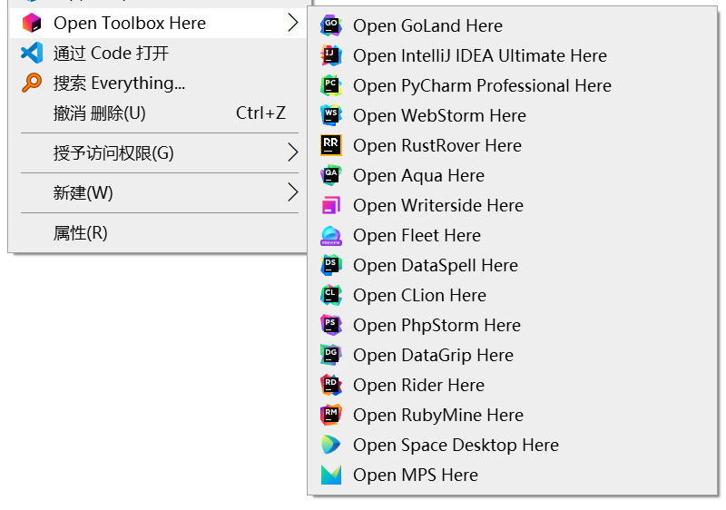
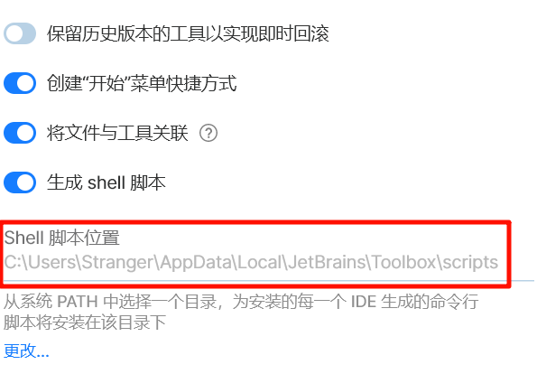

# AutoToolBox

[English](README.en.md)|**简体中文**

>  如果你是旧版使用者，请前往[v2.2.0 · 246859/AutoToolBox (github.com)](https://github.com/246859/AutoToolBox/tree/v2.2.0)查看信息，或者查看[迁移到新版](#迁移)

更新：时隔六年JetBrains终于开始尝试解决上下文菜单的问题，但菜单项是隐藏在打开方式里面的，仅对文件起作用，对于目录和目录背景并不生效，这明明只是一个很简单的功能，却迟迟不支持，所以本项目依旧有存在的必要性。

原问题链接：[TBX-2540 (jetbrains.com)](https://youtrack.jetbrains.com/issue/TBX-2540/Associate-file-extenstions-with-correct-Toolbox-app-or-with-the-Toolbox-itself-so-that-files-can-be-launched-from-Windows) [ TBX-2478 (jetbrains.com)](https://youtrack.jetbrains.com/issue/TBX-2478/Windows-Open-Directory-With-Editor)


## 简介

这是一个很简单的命令行工具，用于给Toolbox App添加windows右键菜单，它具有以下特性：

- 更新或回退版本不会导致菜单失效（同时存在多个版本的IDE时，只会导向最新版）
- 可设置通过管理员权限打开IDE
- 无需手动维护注册表，
- 菜单的展示顺序与Toolbox中的同步

下面是效果图



## 安装

如果你拥有go环境，并且版本大于go1.16，可以采用`go install`的方式来安装，如下所示

```bash
$ go install github.com/246859/AutoToolBox/v3/cmd/tbm@latest
```

或者直接在Release里面下载最新版的二进制文件。


## 使用

3.0版本的工具使用起来简单了很多，虽然多了几个命令但大多数情况下都用不上，唯一需要的路径参数就是Toolbox的安装路径，一般情况下Toolbox被默认安装在如下路径。

```
$HOME/AppData/Local/Jetbrains/Toolbox/
```

工具在默认情况下使用上述路径，不需要额外指定参数，如果安装路径被修改了则需要用`-d`来指定（最好不要修改Toolbox的安装路径）。

请确保设置中的**生成Shell脚本**处于打开状态，否则工具无法正常工具。



### 迁移
如果你是旧版工具的使用者，且想要升级到新版，可以使用旧版生成的`toolboxRemove.reg`将旧版注册表删除，然后再按照下面的方法使用新版即可。

### 开始

> **工具需要管理员权限才能正常运行**

安装好后执行如下命令

```bash
$ tbm set -a
```

就可以将所有本地安装的IDE添加到右键菜单中，这是最简单的使用方法，大多数情况下只会用到这一个命令。


### 命令

```
add         Add ToolBox IDE to existing context menu
clear       clear all the context menu of Toolbox
list        List installed ToolBox IDEs
remove      Remove ToolBox IDEs from context menu
set         Register ToolBox IDEs to context menu
version     Print ToolBox version
```

下面简单讲一下每个命令的大概作用


#### list

```bash
$ tbm list -h
Examples:
  tbm list -c
  tbm list --menu
  tbm list -c --menu

Usage:
  tbm list [flags]

Flags:
  -c, --count   count the number of installed tools
  -h, --help    help for list
      --menu    list the tools shown in the context menu
```

`list`命令用于查看本地所有已安装的IDE，例如

```bash
$ tbm list
Android Studio                  Koala 2024.1.1 Patch 1
Aqua                            2024.1.2
CLion                           2024.1.4
DataGrip                        2024.1.4
GoLand                          2024.1.4
GoLand                          2023.3.7
IntelliJ IDEA Community Edition 2024.1.4
IntelliJ IDEA Ultimate          2024.1.4
MPS                             2023.3.1
PhpStorm                        2024.1.4
PyCharm Community               2024.1.4
PyCharm Professional            2024.1.4
```

查看数量

```bash
$ tbm list -c
25
```

查看所有已添加到菜单中的项

```bash
$ tbm list --menu
Aqua                            2024.1.2
CLion                           2024.1.4
DataGrip                        2024.1.4
DataSpell                       2024.1.3
Fleet                           1.37.84 Public Preview
GoLand                          2024.1.4
IntelliJ IDEA Ultimate          2024.1.4
MPS                             2023.3.1
PhpStorm                        2024.1.4
PyCharm Professional            2024.1.4
Rider                           2024.1.4
RubyMine                        2024.1.4
```

查看已添加到菜单中的项的数量

```bash
$ tbm list --menu -c
16
```


#### set

```bash
$ tbm set -h
Usage:
  tbm set [flags]

Flags:
      --admin     run as admin
  -a, --all       select all
  -h, --help      help for set
  -s, --silence   silence output
      --top       place toolbox menu at top of context menu
  -u, --update    only select current menu items
```

`set`命令表示将哪些IDE设置为菜单项，会直接覆盖现有的菜单，菜单的展示顺序与Toolbox界面中的相同。

最简单的使用方法就是直接将全部IDE设置为菜单项，如果本地的IDE数量超过了16个，那么只会添加前16个，这是因为windows菜单项的最大限制就是16个。

```bash
$ tbm set -a
Warning: too many tools, only first 16 will be added to the context menu
GoLand
IntelliJ IDEA Ultimate
PyCharm Professional
WebStorm
RustRover
Aqua
Writerside
Fleet
DataSpell
CLion
PhpStorm
DataGrip
Rider
RubyMine
Space Desktop
MPS
```

或者单独指定

```bash
$ tbm set GoLand WebStorm
```

如果你需要以管理员权限来运行IDE，那么可以加上`--admin`，就像下面这样，

```bash
$ tbm set -a --admin
```

使用`--update`时只会更新现有的菜单项，不会添加新的菜单。如果同一个IDE存在多个版本，该命令可以将其导向最新版。

```bash
$ tbm set --update
```

在注册菜单时可以使用`--top`来让Toolbox菜单位于置顶的位置

```bash
$ tbm set -a --admin --top
```

<br/>

需要注意的是，有一些产品既没有提供稳定的shell脚本路径，也没有提供`exe`文件的位置，下面几个就是

```
dotMemory Portable              
dotPeek Portable               
dotTrace Portable
ReSharper Tools
```

虽然现阶段可以将其添加到菜单中，但它们的文件结构并不像其他IDE一样具有条理，`list`命令会展示出现哪些工具暂不支持，如下

```bash
$ tbm list
Android Studio                  Koala 2024.1.1 Patch 1
Aqua                            2024.1.2
CLion                           2024.1.4
DataGrip                        2024.1.4
DataSpell                       2024.1.3
dotMemory Portable              2024.1.4                unavailable
dotPeek Portable                2024.1.4                unavailable
dotTrace Portable               2024.1.4                unavailable
Fleet                           1.37.84 Public Preview
```

对于它们而言，暂时不会被添加进菜单中。


#### add

```bash
$ tbm add -h
Usage:
  tbm add [flags]

Flags:
      --admin     run as admin
  -h, --help      help for add
  -s, --silence   silence output
      --top       place toolbox menu at top of context menu
```

`add`命令的区别在于它会向已有的菜单中添加新的菜单项，而不是像`set`一样直接覆盖，用法大体上一致。

```bash
$ tbm add GoLand WebStorm
```

不过它并不支持`-a`，不能一次性添加所有IDE。


#### rmove

```bash
$ tbm remove -h
Command "remove" will remove the specified IDEs from the context menu, use "tbm remove -a" to remove all IDEs.

Usage:
  tbm remove [flags]

Aliases:
  remove, rm

Flags:
  -a, --all       remove all
  -h, --help      help for remove
  -s, --silence   silence output
```

`remove`命令用于删除菜单项

```bash
$ tbm rm GoLand WebStorm
```

使用`-a`来删除所有

```bash
$ tbm rm -a
```


#### clear

```bash
$ tbm clear
clear all the context menu of Toolbox

Usage:
  tbm clear [flags]

Flags:
  -h, --help   help for clear
```

命令`clear`会直接清空所有与Toolbox有关的菜单项，包括顶级菜单，且不会有任何输出。如果你不想再使用本工具，可以用该命令将所有注册表项清理干净。


## 贡献

1. Fork本仓库到你的账号
2. 在Fork的仓库中创建一个新的分支
3. 在新分支中提交代码修改
4. 然后向本仓库发起Pull Request
5. 等待Pull Request
