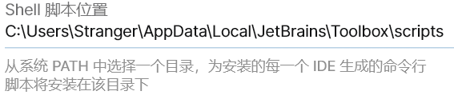
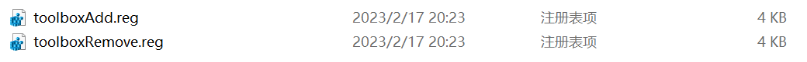
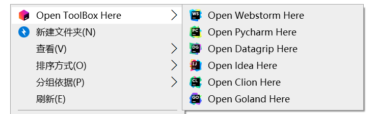
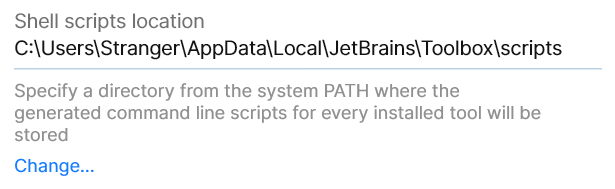

# AutoToolBox

一个自动生成ToolBox注册表脚本的工具，仅限Windows系统。

[简体中文](#简体中文)|[English](#English)

## 简体中文

JetBrain旗下的ToolBox是一款方便管理IDE版本的工具软件，但是对于右键菜单打开项目的功能却迟迟不支持，但是在youtrack上的相关问题最早可以追溯到五年前。网上的大多数方法都是直接将对应IDE的`exe`文件路径写入注册表中，此种方法对于使用ToolBox的用户来说，更新和回退版本后就会导致原有的菜单失效，并且手动修改注册表也十分的繁琐。所幸的是，ToolBox提供了一个稳定的Shell脚本路径，通过将该路径下的脚本注册到注册表中，便可以实现右键菜单的功能。AutoToolBox做的就是根据正确的输入路径，生成两份Windows注册表脚本，直接点击脚本运行就可以修改注册表，由于该目录下的脚本是ToolBox维护的，所以不用担心更新和回退版本失效的问题。

### 脚本路径

首先你需要找到shell脚本路径，脚本路径可以在ToolBox的设置中直接查看，例如



路径为

```
C:\Users\Stranger\AppData\Local\JetBrains\Toolbox\scripts
```

这个路径就是程序的输入路径

### 目录结构

```
dir
|
|---ico
|   |
|   |---idea.ico
|   |
|   |---goland.ico
|   |
|   |---toolbox.ico
|
|---idea.cmd
|
|---goland.cmd
```

在使用之前，先确保输入目录的结构如上，`ico`文件夹是图标文件夹，ToolBox不会自动创建该目录，需要用户自行创建然后去对应的IDE目录里面寻找对应的图标文件，需要注意的是`cmd`文件与`ico`文件名称要一致。

### 生成脚本

使用Github上最新的Relaese的二进制可执行文件，执行如下命令

```
./autotoolbox.exe -path "C:\Users\Stranger\AppData\Local\JetBrains\Toolbox\scripts"
```

最后会在目标目录下生成`C:\Users\Stranger\AppData\Local\JetBrains\Toolbox\scripts\AutoToolBox`，文件夹内有两个脚本：

- `toolboxAdd.reg` - 用于修改注册表，使用后将会添加到右键菜单中
- `toolboxRemove.reg` - 用于撤销对注册表的修改，使用后将会从右键菜单中删除已修改的项



在Windows系统下`reg`脚本可以直接点击执行

### 效果

最终效果是无论右键文件夹或是右键点击文件夹背景都可以看到如下类似的菜单



## English
ToolBox under JetBrain is a tool software that is convenient for managing IDE versions, but it has not supported the function of opening projects from the right-click menu, but the related problems on youtrack can be traced back to five years ago. Most of the methods on the Internet are to directly write the `exe` file path corresponding to the IDE into the registry. For users who use ToolBox, the original menu will become invalid after updating and rolling back the version, and the Modifying the registry manually is also very cumbersome. Fortunately, ToolBox provides a stable shell script path, and by registering the script under this path in the registry, the function of the right-click menu can be realized. What AutoToolBox does is to generate two Windows registry scripts according to the correct input path, and you can modify the registry by directly clicking the script to run. Since the scripts in this directory are maintained by ToolBox, you don’t have to worry about the failure of the update and rollback version. .

### script path

First you need to find the shell script path, the script path can be viewed directly in the ToolBox settings, for example



path is

```
C:\Users\Stranger\AppData\Local\JetBrains\Toolbox\scripts
```

This path is the input path of the program

### Directory Structure

```
dir
|
|---ico
| |
| |---idea.ico
| |
| |---goland.ico
| |
| |---toolbox.ico
|
|---idea.cmd
|
|---goland.cmd
```

Before using, make sure the structure of the input directory is as above, the `ico` folder is an icon folder, ToolBox will not automatically create this directory, users need to create it themselves and then go to the corresponding IDE directory to find the corresponding icon file, you need to pay attention The names of the `cmd` file and the `ico` file must be the same.

### Generate script

Using the latest Relaese binary executable file on Github, execute the following command

```
./autotoolbox.exe -path "C:\Users\Stranger\AppData\Local\JetBrains\Toolbox\scripts"
```

Finally, `C:\Users\Stranger\AppData\Local\JetBrains\Toolbox\scripts\AutoToolBox` will be generated in the target directory, and there are two scripts in the folder:

- `toolboxAdd.reg` - used to modify the registry, it will be added to the right-click menu after use
- `toolboxRemove.reg` - used to undo the modification of the registry, after use, the modified item will be deleted from the right-click menu


The `reg` script can be executed directly by clicking on the Windows system without any tools.

### Effect

The final effect is that you can see a menu similar to the following regardless of right-clicking on the folder or right-clicking on the background of the folder


