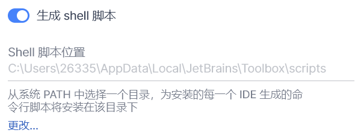

# AutoToolBox

一个可以自动生成ToolBox注册表脚本的简单工具，仅限Windows系统，[youtrack问题链接](https://youtrack.jetbrains.com/issue/TBX-2540/Associate-file-extenstions-with-correct-Toolbox-app-or-with-the-Toolbox-itself-so-that-files-can-be-launched-from-Windows)

JetBrain旗下的ToolBox是一款方便管理IDE版本的工具软件，但是对于右键菜单打开项目的功能却迟迟不支持，但是在youtrack上的相关问题最早可以追溯到五年前。网上的大多数方法都是直接将对应IDE的`exe`文件路径写入注册表中，此种方法对于使用ToolBox的用户来说，更新和回退版本后就会导致原有的菜单失效，并且手动修改注册表也十分的繁琐。所幸的是，ToolBox提供了一个稳定的Shell脚本路径，通过将该路径下的脚本注册到注册表中，便可以实现右键菜单的功能。AutoToolBox做的就是根据正确的输入路径，生成两份Windows注册表脚本，直接点击脚本运行就可以修改注册表，由于该目录下的脚本是ToolBox维护的，所以不用担心更新和回退版本失效的问题。

## 安装
如果你拥有go环境，并且版本大于go1.16，可以采用`go install`的方式来安装，如下所示
```bash
$ go install github.com/246859/AutoToolBox/v2/cmd/toolbox@latest
```
如果没有go环境，可以在Release中下载最新版本的二进制文件。

## 准备

首先你需要确保`生成shell脚本`这个选项勾选了，然后脚本路径可以在ToolBox的设置中直接查看，例如



图中的脚本路径就是工具的输入参数

## 使用
```bash
$ ./toolbox-windows-amd64.exe -h
toolbox is a command line tool to generate win regex scripts for jetbrain ide

Usage:
  toolbox [command] [flags]

Flags:
  -h, --help           help for toolbox
  -i, --input string   input directory (default "C:\\Users\\stranger\\AppData\\Local\\JetBrains\\Toolbox\\scripts")
      --top            whether to set top position
```
工具使用方法十分的简单，只有两个参数，`-i`指定了shell脚本文件夹，如果不携带任何参数执行，工具会尝试在当前用户目录下去查找，也就是`default`的值。`--top`表示右键菜单是否置顶。
```bash
$ ./toolbox-windows-amd64.exe -i C:\\Users\\Stranger\\AppData\\Local\\JetBrains\\Toolbox\\scripts
```

最后会在目标目录下生成`ico`和`regx`文件夹，`ico`目录存放了修改注册表所需的图标文件请不要随意删改，`regx`目录存放着注册表脚本。

- `toolboxAdd.reg` - 用于修改注册表，使用后将会添加到右键菜单中
- `toolboxRemove.reg` - 用于撤销对注册表的修改，使用后将会从右键菜单中删除已修改的项


直接点击执行即可

> 如果在使用过程中提示`access denied`之类的错误，请用管理员模式打开命令行

### 效果
最终效果如下，对于文件夹或文件夹背景都会生效。


